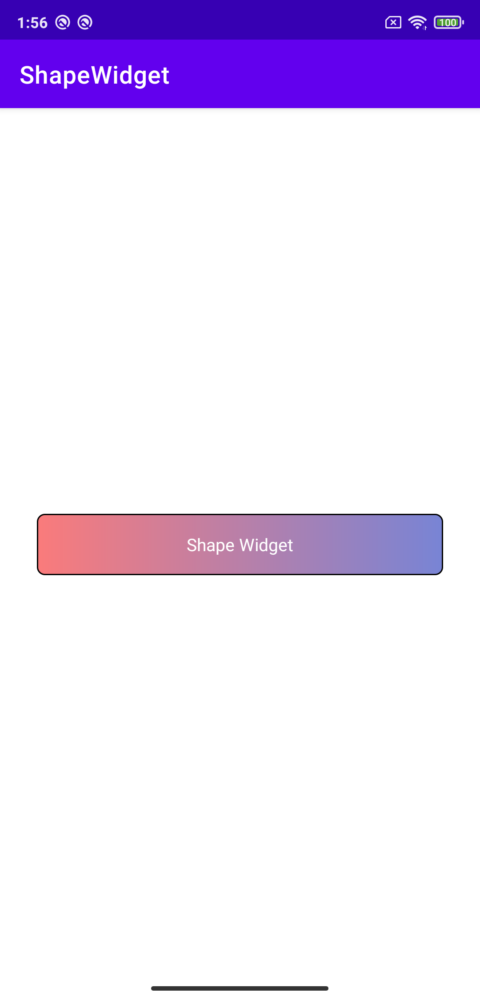

## ShapeWidget
  
 

## 截图


## Gradle 使用
[](https://jitpack.io/#Idumuzhou/ShapeWidget)
```
添加依赖：
implementation 'com.github.Idumuzhou:ShapeWidget:版本号看上面'
```
项目根目录`build.gradle`中添加如下：
```
allprojects {
    repositories {
        ...
        maven { url 'https://jitpack.io' }
    }
}
```